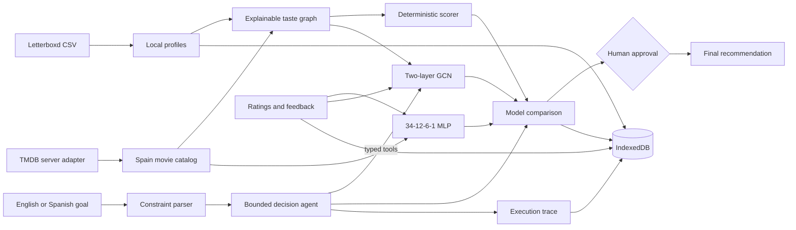

# Architecture

Reel Circle separates deterministic decisions, learned models, agent orchestration, and presentation so each layer can be tested independently.

## Agent loop

The agent follows a bounded plan-act-observe policy with at most eight steps. It can parse constraints, request active-learning input, train the GCN, compare models, request constraint relaxation, and propose a final pick. Constraint relaxation and final selection require explicit approval.

## Recommendation layers

1. Candidate filtering applies runtime, genre, mood, platform, and watched-history constraints.
2. The explainable scorer computes individual scores and applies the selected group-fairness strategy.
3. A local MLP or GCN can contribute a confidence-scaled score.
4. The experiment layer compares baseline and hybrid rankings before agent use.

## Privacy

Profiles, feedback, model outputs, experiments, and traces are stored in IndexedDB. Share links omit raw ratings, watched-film history, model results, experiments, and agent traces. TMDB credentials remain server-side.

## Performance boundaries

TensorFlow.js is lazy-loaded on first training. The current GCN uses a dense adjacency matrix and is intended for a small prototype catalog. A production-scale graph should use sparse tensors, sampled neighborhoods, offline embeddings, and a retrieval/reranking architecture.

TMDB discovery is paginated through the browser in bounded 20-film server calls. Each server call enriches one discovery page, while the client deduplicates up to 200 initial films and can load later pages incrementally. Only the ranked top candidates are rendered in the graph and shortlist.
