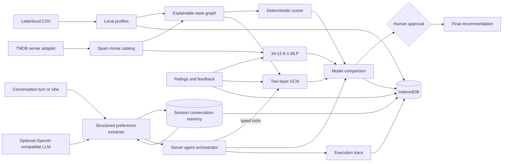

# Architecture

Reel Circle separates deterministic decisions, learned models, agent orchestration, and presentation so each layer can be tested independently.

## Conversational recommendation flow

Each turn is merged into a typed `ConversationPreferences` state. Positive genres, explicit exclusions, moods, runtime, release period, language, group size, and viewing context persist across refinements. For example, `I do not want horror` followed by `something darker, under 90 minutes` keeps horror excluded while adding a darker mood and runtime boundary. The same state drives filtering, recommendation explanations, and the visible interpretation chips.

Conversation messages and preferences are stored only in IndexedDB and can be cleared from the agent or with **Delete data**. Shared room URLs deliberately exclude conversation text.

When `VITE_MOVIE_API_URL` is configured, turns are sent to `POST /api/agent`. The server attempts strict JSON-schema extraction with an OpenAI-compatible model, then runs deterministic filtering, ranking, and hard-constraint validation. If the model is absent or fails, the same endpoint falls back to the deterministic extractor. The response includes extraction mode, latency, and an observable tool trace.

Raw Letterboxd ratings and watched-film history are stripped by the client adapter. The server receives bounded movie candidates and privacy-safe learned preference weights.

## Agent loop

The agent follows a bounded plan-act-observe policy with at most eight steps. It can parse constraints, request active-learning input, train the GCN, compare models, request constraint relaxation, and propose a final pick. Constraint relaxation and final selection require explicit approval.

## Recommendation layers

1. Candidate filtering applies runtime, genre, mood, platform, and watched-history constraints.
2. The explainable scorer computes individual scores and applies the selected group-fairness strategy.
3. A local MLP or GCN can contribute a confidence-scaled score.
4. The experiment layer compares baseline and hybrid rankings before agent use.

## Privacy

Profiles, feedback, model outputs, experiments, and traces are stored in IndexedDB. Share links omit raw ratings, watched-film history, model results, experiments, and agent traces. TMDB credentials remain server-side.

## Performance boundaries

TensorFlow.js is lazy-loaded on first training. The current GCN uses a dense adjacency matrix and is intended for a small prototype catalog. A production-scale graph should use sparse tensors, sampled neighborhoods, offline embeddings, and a retrieval/reranking architecture.

TMDB discovery is paginated through the browser in bounded 20-film server calls. Each server call enriches one discovery page, while the client deduplicates up to 200 initial films and can load later pages incrementally. Only the ranked top candidates are rendered in the graph and shortlist.

## Production service boundary

The current deployment remains local-first but now has an optional hosted LLM extraction path behind `/api/agent`. It does not yet claim LangGraph or vector-search capabilities. The next backend phase should add embedding generation and vector retrieval behind this boundary. A production implementation can add LangGraph with a durable checkpointer and Qdrant or pgvector without moving TMDB credentials or raw user history into the browser.
