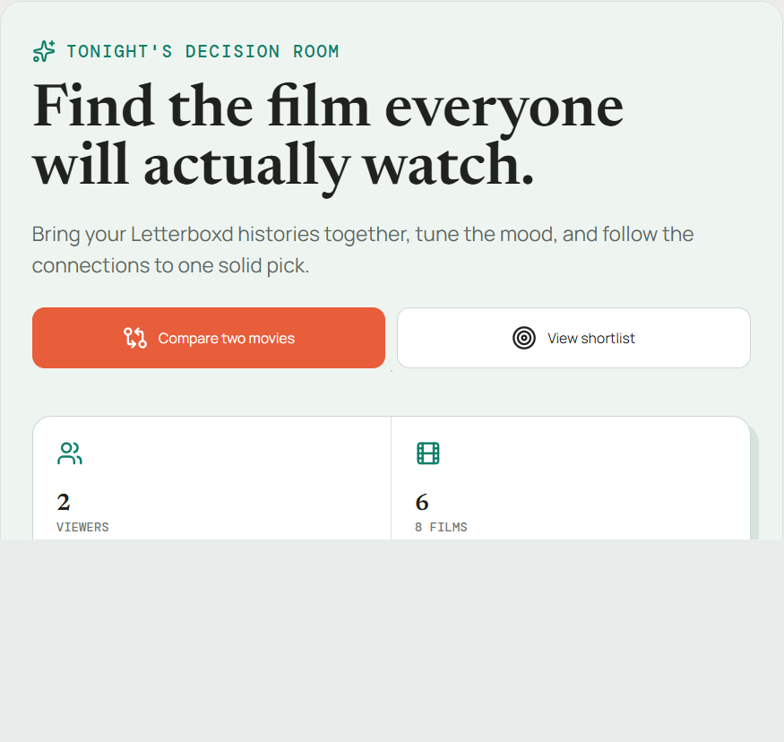

# Reel Circle

A privacy-first group movie recommender that turns Letterboxd histories into a fair, explainable shortlist. Reel Circle combines conversational constraints, graph-based taste signals, local neural models, and human approval gates to help a group choose what to watch.



## Why this project

Movie recommendations are usually optimized for one person. Reel Circle treats movie night as a group decision problem: it removes already-watched films, models each person's preferences, balances disagreement, and explains why a candidate fits the group.

The default experience is a focused decision dashboard. The optional AI lab exposes the underlying MLP, graph convolutional network, agent trace, confidence, and ranking experiments without making those tools prerequisites for using the product.

## Technical highlights

- **Stack:** React 19, TypeScript, Vite, TensorFlow.js, React Flow, IndexedDB, Vitest, and Playwright.
- **Privacy:** Letterboxd files and learned preferences stay in the browser; shared room links omit viewing history and raw ratings.
- **Recommendation system:** deterministic ranking plus confidence-weighted MLP and two-layer GCN prototypes.
- **Group fairness:** balanced, average, least-misery, and Nash aggregation strategies.
- **Agent safety:** an eight-step bounded plan-act-observe loop with typed tools, persistent traces, and approval gates.
- **Quality:** 63 unit tests, an end-to-end movie-night workflow, ESLint, production builds, and dependency auditing in CI.

## Project documentation

See [PORTFOLIO.md](PORTFOLIO.md) for the model architecture, experiment methodology, demo script, and technically accurate portfolio wording.

See [ARCHITECTURE.md](ARCHITECTURE.md) for system boundaries, data flow, privacy decisions, and scaling constraints.

## Advanced features

- IndexedDB persistence for profiles, learned preferences, filters, graph positions, and feedback history.
- Bilingual conversational constraints such as `Algo divertido en Filmin de menos de 90 minutos`.
- Balanced, average, least-misery, and Nash group-ranking strategies.
- Active-learning comparisons and direct skip, pick, and post-watch feedback.
- Deep graph signals for directors, languages, moods, and decades.
- Local acceptance and interaction metrics.
- Privacy-safe room links that exclude raw ratings and watched-film history.
- A real TensorFlow.js neural recommender trained locally for each person.
- A two-layer graph convolutional network with normalized movie-feature message passing and masked movie-node supervision.
- An experiment lab comparing deterministic, MLP, and GCN rankings with confidence, loss, rank-shift, overlap, disagreement, and path metrics.
- A bounded autonomous decision agent with typed tools, observable traces, active-learning pauses, and human approval gates.
- Agent evaluation metrics and downloadable privacy-safe experiment reports.
- GitHub Actions validation for tests, lint, build, and production dependency audit.
- First-run onboarding, local backup/delete controls, resilient catalog caching, and accessible keyboard dialogs.
- Persistent light/dark theming that defaults to the operating-system preference.
- Persistent English/Spanish interface toggle that defaults to the browser language.
- A focused default movie-night dashboard with the technical AI tooling behind the optional **Open AI lab** control.

## Neural recommender

The neural model is separate from the explainable taste graph. Open **Neural** in the graph toolbar to inspect its architecture:

```text
34 inputs → 12 ReLU neurons → 6 ReLU neurons → 1 sigmoid preference score
```

Movie genres, directors, languages, moods, and decades use deterministic feature hashing into 32 inputs. Runtime and community rating provide two numeric inputs. Matching Letterboxd ratings and in-app feedback become supervised labels.

At least four distinct labeled catalog films are required before training. TensorFlow.js is lazy-loaded only when **Train network** is pressed, trains on the local CPU, and does not upload data. Neural predictions are blended with the explainable score according to measured confidence and can be disabled at any time. Serializable predictions persist locally; new feedback invalidates stale predictions until retraining.

## Run locally

```bash
npm install
npm run dev
```

Open `http://localhost:5173`. The app ships with two demo profiles so the graph is useful immediately.

## Live TMDB catalog

The repository includes a Vercel serverless endpoint at `api/catalog.ts`. It fetches movie details and current Spain watch providers without exposing the TMDB credential to the browser.

1. Copy `.env.example` to `.env.local`.
2. Set `TMDB_BEARER_TOKEN` to a TMDB API read access token.
3. Set `VITE_MOVIE_API_URL=/api`.
4. Run the project with `npx vercel dev` so the serverless endpoint is available locally, or deploy to Vercel.

When no backend is configured or available, the app safely falls back to the curated catalog.

The live client loads ten paginated TMDB discovery pages by default, producing a ranking pool of up to 200 enriched movies available in Spain. The interface still renders only the highest-ranked shortlist. Use **Load 100 more** to fetch another five pages, or search a title directly to add enriched search results to the pool. Configure `VITE_MOVIE_CATALOG_PAGES` between 1 and 20 to change the initial pool size.

Successful live catalogs are cached in IndexedDB for 24 hours and rendered immediately on later visits while a background refresh runs. If refresh fails, the app keeps the cache or falls back to the curated catalog with an explicit status message.

## Import Letterboxd data

1. In Letterboxd, open **Settings → Import & Export** and request an export.
2. Use **Add Letterboxd CSV** for each person.
3. Select a CSV containing the standard `Name`, `Year`, and optional `Rating` columns, such as `ratings.csv`, `watched.csv`, or `diary.csv`.

The importer also accepts a Letterboxd RSS feed, including extensionless downloaded files. RSS feeds usually contain only the latest 50 activity entries; use Letterboxd **Settings → Data → Export Your Data** for complete history.

Parsing and recommendations run entirely in the browser. Files are not uploaded or persisted. Importing multiple files creates multiple people; remove demo profiles with the close button when using real data.

## How recommendations work

- A movie watched by anyone in the group is removed.
- Community rating, each person's genre affinity, and short runtime contribute to the score.
- Large differences between people's scores reduce the group score.
- Runtime and genre controls filter the shortlist and graph immediately.
- Platform controls match any selected provider and can be combined with the other filters.
- Select a person, then use **Skip**, **Picked**, or **Loved it** to teach their local taste model. Learned genre weights immediately alter rankings and graph edges.
- Run **Ask a taste question** to compare two deliberately contrasting, uncertain candidates. The answer updates positive and negative signals in one step.
- Drag graph nodes to rearrange the map. Select people, genres, and films directly on the graph to change the learner, toggle a filter, or inspect a candidate.

The curated fallback in `src/data.ts` has illustrative Spain availability. The configured TMDB endpoint supplies live metadata and watch-provider data. Provider listings still depend on TMDB coverage and should be treated as discovery information rather than a purchase guarantee.

Shared room links are asynchronous snapshots, not real-time collaboration. They deliberately omit private viewing history. Real-time voting would require an authenticated service such as Supabase Realtime.

The Experiment Lab provides local backup and delete-all-data controls. Delete removes profiles, ratings, model outputs, traces, and cached catalog data. TMDB metadata and images require TMDB attribution; the application footer includes the required non-endorsement notice.

## Quality checks

```bash
npm test
npm run test:e2e
npm run lint
npm run build
```
